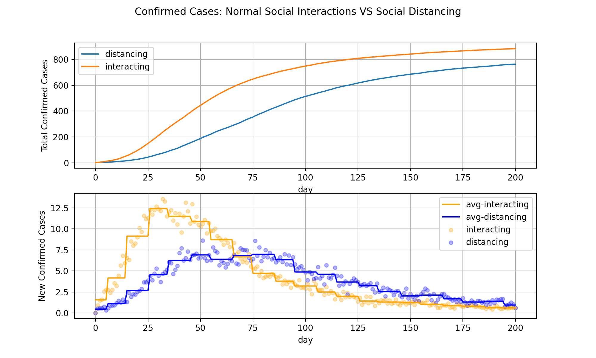

# Social Distancing

This repository contains an epidemic simulation outcome under two different strategies: 
* Normal social interactions
* Social distancing



## Setup

1. Create and activate a virtual environment:
    * Create: `python -m virtualenv --python=python3.7 venv`
    * Activate Linux/MacOS: `source venv/bin/activate`
    * Activate Windows: `source venv/Scripts/activate`
1. Install requirements:
    * `pip install -r requirements.txt`
    
The application will run according to the environment variables you define. If a particular config is not found on the environment, either the `default.json` values will be used or a hard-coded value on the `settings.py` module. 

All environment variables use the `SOCIAL_DISTANCING_` prefix since that's the general application name. Relevant environment variables:

* `SOCIAL_DISTANCING_VAR_POPULATION`
    * **Description**: Number of people to simulate. 
    * **Default**: 1000
* `SOCIAL_DISTANCING_VAR_STRATEGY`
    * **Description**: Strategy to be used during simulation (determines default values). 
    * **Options**: `social-interacting`, `social-distancing`
    * **Default**: Determined on `default.json`.
* `SOCIAL_DISTANCING_VAR_PERCENT_STUDENTS`
    * **Description**: Number of students per 100 people.
    * **Default**: Determined on `default.json`.
* `SOCIAL_DISTANCING_VAR_PERCENT_WORKERS`
    * **Description**: Number of workers per 100 people.
    * **Default**: Determined on `default.json`.
* `SOCIAL_DISTANCING_VAR_PERCENT_WORKER_STUDENTS`
    * **Description**: Number of worker-students per 100 people.
    * **Default**: Determined on `default.json`.
* `SOCIAL_DISTANCING_VAR_PERCENT_STAY_HOME`
    * **Description**: Number of stay-at-home people per 100 people. 
    * **Default**: Determined on `default.json`.
* `SOCIAL_DISTANCING_VAR_FACTORY_NUM_HOMES`
    * **Description**: Number of homes per 100 people. 
    * **Default**: 40
* `SOCIAL_DISTANCING_VAR_FACTORY_NUM_WORKPLACE`
    * **Description**: Number of workplaces per 100 people. 
    * **Default**: 10
* `SOCIAL_DISTANCING_VAR_FACTORY_NUM_UNIVERSITY`
    * **Description**: Number of universities (schools) per 100 people. 
    * **Default**: 1
* `SOCIAL_DISTANCING_VAR_FACTORY_NUM_PUBLIC`
    * **Description**: Number of public places per 100 people.
    * **Default**: 15

## Use case

Open 2 terminals, activate the virtualenv and run the following commands (one per terminal):

```commandline
$ SOCIAL_DISTANCING_VAR_STRATEGY="social-interacting" python main.py simulate-multiple --name out-1 --simulations 5 --days 300
```

```commandline
$ SOCIAL_DISTANCING_VAR_STRATEGY="social-distancing" python main.py simulate-multiple --name out-1 --simulations 5 --days 300
```

The output of the `social-interacting` and `social-distancing` strategies will be combined on the same directory named `out-1`. 

Now you can run the `analyze` command: 

```commandline
python main.py analyze --simulation-name out-1 --days 250 --show
```

## Usage

Run the application as following: 

```commandline
$ python main.py [command] [options]
```

You can specify a particular environment variable on the context of the application as following:

```commandline
$ SOCIAL_DISTANCING_VAR_STRATEGY="social-distancing" python main.py [command] [options]
```

The environment variable ALWAYS overwrites the `default.json` values. 

### Show strategies

Print the strategies on the commandline. 

```
show-strategies
```

**Example**

```commandline
$ python main.py show-strategies
* social-interacting
* social-distancing
```

### Simulate

Simulate a single scenario:

```
simulate --days {days} --filename {filename} --show
```

```
    --days: integer representing the number of days to simulate.
    --filename: if present, saves the simulation results output on a csv-file.
    --show: if present, shows a plot of the confirmed cases over time.
```

**Example** 

Run a single simulation of the pandemic outcome during 300 days using the social distancing strategy and show the results. 

```commandline
SOCIAL_DISTANCING_VAR_STRATEGY="social-distancing" python main.py simulate --days 300 --show
```

### Simulate Multiple (Recommended)

Run multiple simulations on parallel.

```
simulate-multiple --name {name} --simulations {n} --days {days}
```

```
    --name: string representing the simulation name. A directory will be created containing the simulation(s) output.
    --simulations: integer representing the number of simulations to run. 
    --days: integer representing the number of days to simulate.
    
```

**Example** 

Run 5 simulations of the pandemic output for 300 days using the social distancing strategy. Save the results on a directory called `out-1`. 

```commandline
SOCIAL_DISTANCING_VAR_STRATEGY="social-distancing" python main.py simulate-multiple --name out-1 --simulations 5 --days 300
```

### Analyze (Recommended)

Analyze the aggregate results of the Simulate Multiple command.

```
analyze --simulation-name {name} --days {days} --avg-days {avg-days} --save {filename} --show 
```

``` 
    --simulation-name: string representing the path of the multiple-simualtion results.
    --days: number of max days to analyze. Default value is `None` meaning to not filter out days.
    --avg-days: Plot the average of n-days. Default: 10.
    --save: filename (png) to save the plot.
    --show: show plot. 
```

**Example**

Analyze the first 200 days of the `out-1` simulation:

```commandline
python main.py analyze --simulation-name out-1 --days 200 --show
```
